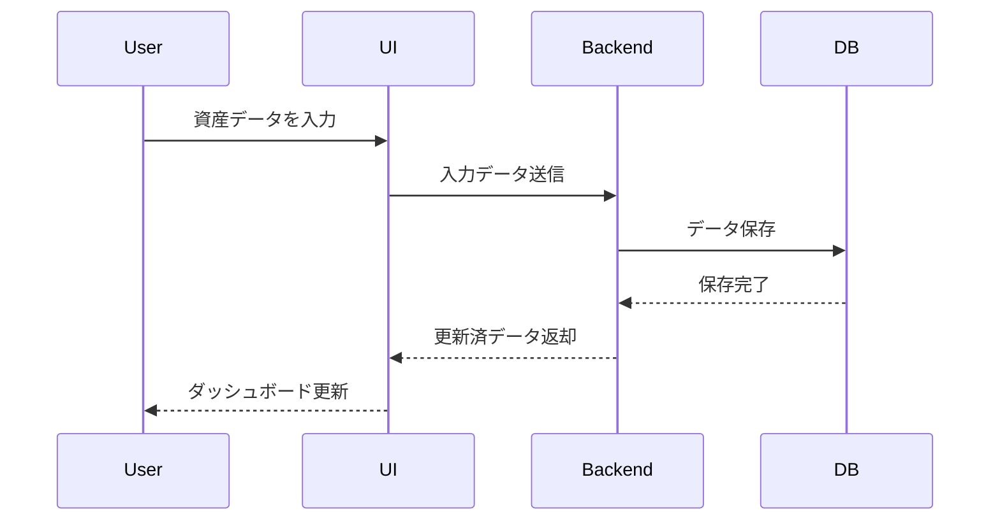

# 資産管理アプリケーション 設計書 (Architecture)

## 1. システム全体像
本システムはローカルPC上で稼働する資産管理アプリケーションであり、Pythonを中心に実装される。データはSQLiteに保存され、UIはローカルアプリ形式（初期は簡易Web UI）で提供する。

```mermaid
graph TD
    User[ユーザ] --> UI[アプリUI (ダッシュボード, 入力フォーム)]
    UI --> Backend[アプリケーションロジック (Python)]
    Backend --> DB[(SQLite DB)]
    Backend --> Chart[グラフ生成]
    Backend --> Table[データ表生成]
```

---

## 2. コンポーネント構成

- **UI層**
  - ダッシュボード（総資産カード、グループ推移グラフ、個別資産カード）
  - 入力フォーム（資産追加・編集・削除）
  - データ表オーバーレイ表示

- **アプリケーション層**
  - 入力データ処理
  - グラフ/表生成ロジック
  - データ移行機能（Excel→DB）

- **データ層**
  - SQLiteによる資産データの永続化
  - テーブル設計
    - assets（資産マスタ: id, name, group, type）
    - records（取引/記録: id, asset_id, date, amount, note）
    - groups（資産グループ: id, name）

---

## 3. データフロー



---

## 4. UI設計
- **左カラム**: 総資産表示、グループ別推移（エリアチャート）、月次サマリ
- **右カラム**: 個別資産カード（スパークライン付）。マウスオーバーで詳細表表示

---

## 5. 技術スタック
- 言語: Python
- DB: SQLite
- UI: Streamlit または PyQt / Electron + Python バックエンド
- グラフ描画: Plotly, Matplotlib
- データ移行: pandas (Excel/CSV読込)

---

## 6. 将来拡張
- Web UIフレームワーク（FastAPI, React）への拡張
- 外部API連携による自動入力
- AIを用いた支出/資産分析
